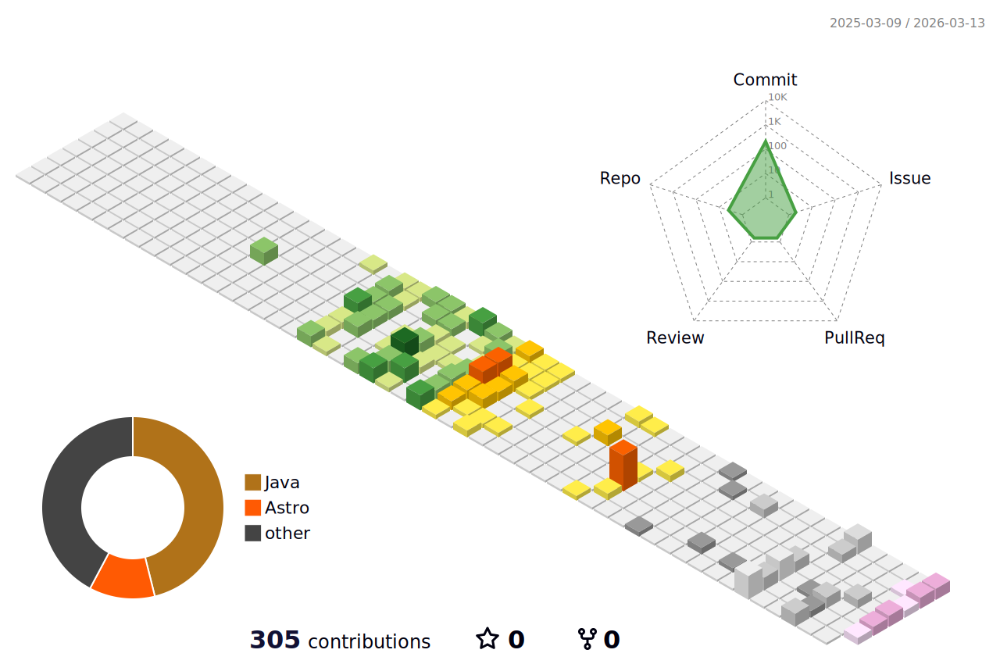

<!-- 打字动画标题 -->

  

<!-- 顶部大图 -->

  

# 🌸 关于我

<h3 align="center">
  本人热爱互联网和图形学，喜欢摄影、游戏、影视动画以及ACG文化。  
  尽管我是个比较宅的人，但我对消费电子设备和二次元世界充满兴趣，  
  番剧、电影总是我生活的一部分。  
  我希望成为一名顶尖的技术栈开发者和个人游戏开发者……
</h3>
 
## 📚 正在学习的技术栈

  <a href="https://skillicons.dev">
     
     
     
    
  </a>

  
  

  

